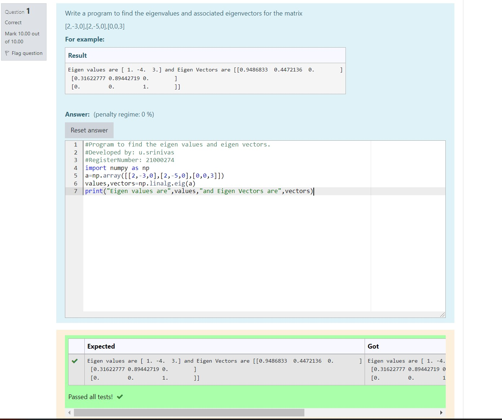

# EIGENVALUES-AND-EIGENVECTORS
## Aim:
To write a python program to find the Eigenvalues and Eigen Vectors
## Equipment’s required:
1. 	Hardware – PCs
2. 	Anaconda – Python 3.7 Installation / Moodle-Code Runner
## Algorithm:
### Step1 : 
created the python code 
### Step 2: 
get the values from the user
### Step 3:
 Using the np.linalg.eig(),  we get two results (first is eigenvalue and second is eigenvector) of the given matrix.
### Step 4: 
end the program

## Program:
~~~
import numpy as np
a=np.array([[2,-3,0],[2,-5,0],[0,0,3]])
values,vectors=np.linalg.eig(a)
print("Eigen values are",values,"and Eigen Vectors are",vectors)
~~~

## Output:

## Result:
Thus the Eigenvalue and Eigenvector is successfully solved using python program
